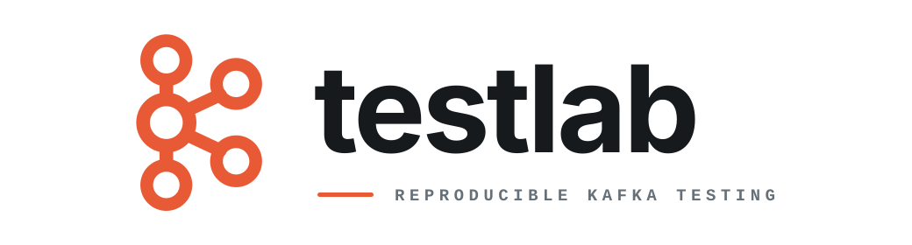

<p align="center">
  
</p>

<p align="center"><strong>Black-box release qualification for Kafka clients.</strong></p>
<p align="center">Packaged artifacts. Real brokers. Independent evidence.</p>

<p align="center">
  <a href="#model">Model</a> ·
  <a href="#run">Run</a> ·
  <a href="#coverage">Coverage</a> ·
  <a href="#evidence">Evidence</a> ·
  <a href="#scope">Scope</a>
</p>

<br />

`testlab` exercises Kafka clients through their public packaged surface. It
runs deterministic scenarios against pinned Kafka environments, observes the
broker independently, and seals a release-facing verdict that can be replayed
and audited.

## Model

```text
packaged client -> external adapter -> Kafka
                         ^             |
                         |             v
                      testctl -> independent observer -> verifier -> evidence
```

Adapters are standalone processes speaking a versioned JSON Lines protocol.
They report what the client said; they do not decide whether the broker agrees.
`testctl` owns the environment, deadlines, disruption controls, verification,
and evidence.

The in-process model broker tests the harness itself. Only real Kafka runs
support compatibility or release claims.

## Run

Validate the repository and its reference qualification:

```sh
zcheck
```

Qualify a packaged Kafkars checkout against real Kafka with Docker:

```sh
scripts/qualify-kafkars-candidate ../kafkars pr
scripts/qualify-kafkars-candidate ../kafkars release
```

The `pr` tier is a one-pass public-surface smoke test. The `release` tier runs
the complete version, security, topology, transaction, and disruption matrix.
The candidate is packaged first, then the adapter is built only against those
artifacts and Kafkars's exact reviewed driver and wire packages. Legacy
sibling-source candidates package and content-address all nine local crates.
Published-dependency candidates must declare exact registry versions; Testlab
binds the six driver and wire artifacts to the unique crates.io checksums in the
candidate lock, verifies the extracted engine manifest, and rejects any adapter
resolution drift before the locked build. Each recorded registry identity is
Cargo's locked, verified crate-archive SHA-256.

Kafkars CI can invoke the same boundary without owning broker setup:

```yaml
- uses: kafkars/testlab@<full-commit-sha>
  with:
    kafkars-path: ${{ github.workspace }}
    qualification: pr
    evidence-directory: testlab-evidence
```

## Coverage

PR qualification runs one pass. Release qualification keeps its full matrix and
repetitions. Client repositories call the pinned reusable workflow
`.github/workflows/qualification-release.yml`, passing the same commit in
`testlab-ref`. It derives cells from Testlab's release manifest, schedules the
longest cells first across at most eight runners, and aggregates the latest
artifact for every expected cell across rerun attempts. Failed cell shards are
still sealed into complete diagnostic evidence before the workflow reports the
failure. A small final job recursively verifies the current attempt's sealed
aggregate and is the release verdict. Missing, stale, corrupt, failed, or incomplete evidence fails closed;
an aggregate runner that stalls during post-upload cleanup is bounded without
discarding already sealed evidence. Cell jobs have a 75-minute outer bound.
For manual cell execution, use the action's optional `cell` input and
`testctl aggregate-qualification`; see
[the evidence contract](docs/EVIDENCE.md#qualification-evidence). A cell result
alone never establishes complete release qualification.

| Area | Current qualification |
| --- | --- |
| Kafka | Apache Kafka 3.7.2 through 4.3.1 |
| Topology | Single broker and three-broker clusters |
| Security | Plaintext, TLS, SASL/PLAIN, and SCRAM-SHA-256/512 |
| Behavior | Produce across all public compression codecs with explicit limits/retry policy, stage-aware cancellation, complete public client metrics snapshots, assigned/group/share consume, configured Share record and acquisition-range limits, mixed Share batch decisions and redelivery, repeated readiness and flush plus independent-client shutdown isolation, direct beginning/end/exact-offset positioning, assigned and classic/KIP-848 group seek, pause/resume, clone-shared shutdown, latest offset reset, read-committed isolation, incremental assignment with survivor-cursor retention, exact null/empty/tombstone/header fidelity, same-partition ordering, deterministic concurrent actors, admin including singleton `DescribeTopicPartitions`, caller-ordered detailed plural topic descriptions, caller-ordered plural name-based topic deletion with mixed outcomes, singleton and caller-ordered plural record deletion including the high-watermark boundary, singleton and caller-ordered plural empty classic-group deletion, singleton and caller-ordered plural active Share-group state and assignment descriptions, singleton and caller-ordered plural selected Share-group offset listing, Share-group offset alteration/deletion, caller-ordered Share-group deletion, consumer-only and generic all-group discovery, caller-ordered batch offsets, ACL, client-quota, and named-user SCRAM credential lifecycles, plus source-preserving invalid-partition routing failures, multi-record and consume-transform-produce transactions, fencing, restart, rolling recovery, broker-role failover, authorization recovery, and quotas |
| Truth | Producer, consumer, and committed transaction records and coordinates checked against independent librdkafka observation; singleton and caller-ordered plural topic topology or absence, including precondition and post-deletion metadata, exact singleton and caller-ordered plural record-deletion ranges before and after each boundary, committed group checkpoints, and singleton or caller-ordered plural empty classic-group absence independently queried; singleton and caller-ordered plural active Share-group state and member counts plus singleton and caller-ordered plural selected Share-group start-offset and lag baselines, mutation post-state, offset-deletion absence, and whole-group listing absence, ACL, client-quota, and non-secret SCRAM credential state independently queried through Kafka's CLI; and aborted checkpoint transfers proved unchanged by exact redelivery |

Kafka images are pinned by digest. Scenario topics must have leaders and full
in-sync replicas before a client starts.

Checked-in scenarios for sibling and replacement producers and two independent
direct consumers on one client are deliberately excluded from Kafkars packs.
Their presence in the catalog is not qualification evidence or a support claim.

## Evidence

Every scenario produces ordered history, broker observations, manifests,
digests, a reproduction command, and one deterministic verdict:

- **passed** — valid evidence and every contract held;
- **failed** — valid evidence, but the client violated a contract;
- **invalid** — infrastructure, protocol, process, or harness failure prevents
  a compatibility claim.

Failures and retries never overwrite prior evidence. LLM output never decides
validity, pass/fail, or release eligibility.

## Scope

| Repository | Owns |
| --- | --- |
| Client repository | Implementation-aware unit, invariant, simulation, and loopback tests |
| `testlab` | Packaged adapters, broker environments, scenarios, independent verification, and release evidence |

Performance methodology and profiling belong in
[`kafkars/benchmarks`](https://github.com/kafkars/benchmarks).

## Status

Testlab is under active development. A client is supported only where a
complete qualification cell has passing archived evidence; source-level or
model-broker success is not a broker-compatibility claim.

Read [`ARCHITECTURE.md`](ARCHITECTURE.md), the
[`control protocol`](docs/CONTROL_PROTOCOL.md), and the
[`evidence contract`](docs/EVIDENCE.md) before changing trust boundaries.

## License

Apache-2.0. Apache Kafka is a trademark of the Apache Software Foundation. This
project is independent and is not endorsed by the Apache Software Foundation.
